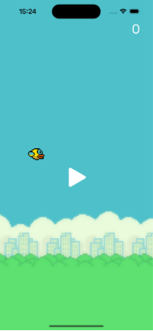
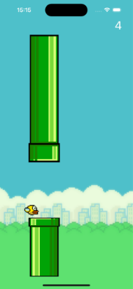
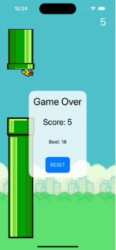

Flappy Bird — игра, в которой игрок с помощью касаний экрана должен контролировать полёт птицы между рядами зелёных труб, не задевая их.

Цель игры состоит в управлении полётом птицы, которая непрерывно передвигается между рядами зелёных труб. При столкновении с ними происходит завершение игры. Управление производится касанием экрана, при котором птица совершает небольшой рывок вверх. При отсутствии рывков птица падает из-за силы тяжести, и игра также завершается. Очки набираются при каждом успешном перелёте между двумя трубами.

  

Игра написана на SwiftUI
